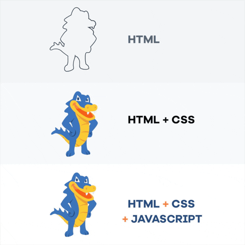

## Learning outcomes

1. Brush up on creating simple web pages using *HTML* and present content using different `html` elements.
2. Brush up on styling web pages using *CSS* to make the page look aesthetically pleasing.
3. Practice using of **Git and GitHub** in a development cycle.
4. Learn to deploy and host your webpage using **GitHub Pages**

## Background

### HTML and CSS

HTML and CSS are two of the core technologies for building Web pages. HTML is the language through which we describe the structure of the page, and CSS is the language through which we describe the visual and aural layout of the page, and the overall presentation of the page for different devices and screen sizes.

Once we learn about JavaScript, you'll see how it adds interactivity to your page



### Git and GitHub

Git is software for tracking changes in any set of files. It's most commonly used for coordinating and sharing source code among developers during software development. GitHub is a cloud-based hosting service for git repositories.

## Guidelines

* This assignment utilized automated-tests to check for the correctness of your code. These tests can be a bit specific about what you name things, where do you place them, what `HTML` tag you use for them, ...etc. Please Follow the instructions on this assignment for the best outcome.
* This is a lab-style assignment with step-by-step
* Learn to make frequent git commits.
  * The instructions will suggest a few checkpoints where you can commit the code. This will be marked by the following icon:  🚩
    * This won't be in all assignments.
  * 💬 As a rule of thumb, you should commit your code at the end of every complete thought.
  * Planning your code will help you identify checkpoints  🚩  where you can commit your code.
  * Use meaningful commit messages.
* To be able to run the automated grading checks, make sure you have installed Node.js, per the instructions posted on Canvas.

<hr />

## Instructions
In this lab, you'll brush up on Creating a Web Page and learn to use git to manage your code. You will also end this lab by learning to deploy and host your webpage using GitHub Pages.

The instructions are split into **2-parts**:
- **In [Part 1](part1)**, you'll create the web page, and style it using css and bootrstrap.
  - make sure you follow the instructions carefully and commit your code at the checkpoints marked with the 🚩 icon.
- **In [Part 2](part2)**, you'll run the self-check/autograder tests and deploy and host your webpage using GitHub Pages.

<iframe width="560" height="315" src="https://www.youtube-nocookie.com/embed/O7UqfRtQqds" title="YouTube video player" frameborder="0" allow="accelerometer; autoplay; clipboard-write; encrypted-media; gyroscope; picture-in-picture" allowfullscreen></iframe>

-----

## Setup

1. Accept the assignment on canvas.
  This will create a repository for you with a few starting files. The following directories are the only ones you're allowed to modify

    ```raw
    .
    ├── resources
    │   ├── images
    │   │   └── .gitkeep
    │   ├── scripts
    │   │   └── index.js
    │   └── styles
    │       └── styles.css
    ├── index.html
    └── README.md
    ```

2. Clone down the project to your computer.
    * [Using GitHub Desktop](https://help.github.com/en/desktop/contributing-to-projects/cloning-a-repository-from-github-to-github-desktop)
    * OR [using command line tools](https://help.github.com/en/github/creating-cloning-and-archiving-repositories/cloning-a-repository)

3. Open the project in Visual Studio Code.
  a. make sure you select the root folder when opening the project. It will be named something like `1.student-portfolio-YOUR_USERNAME`

<hr />
