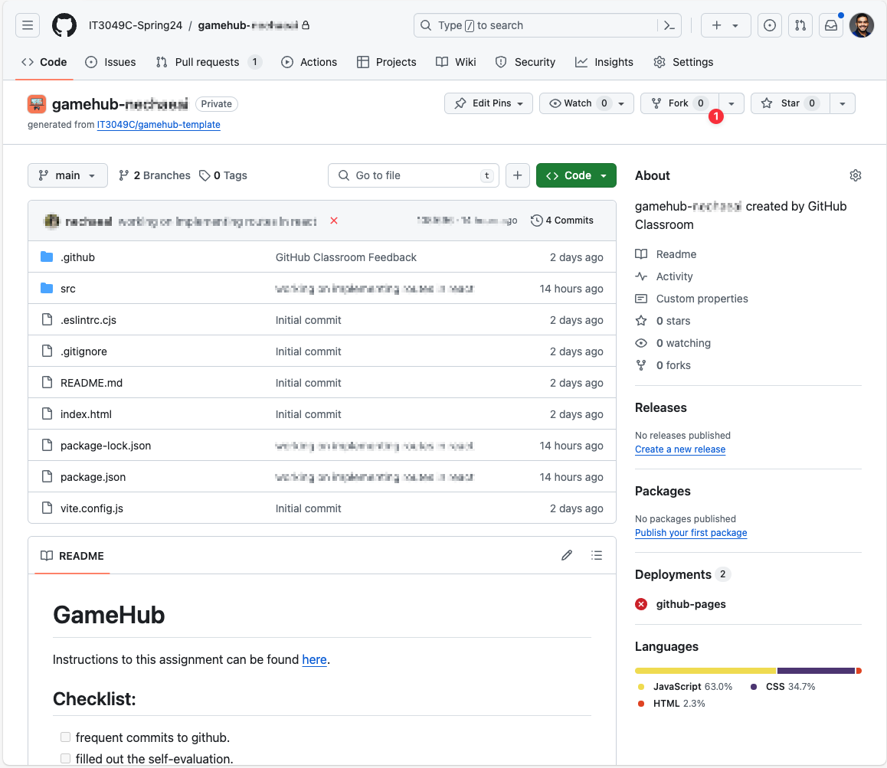
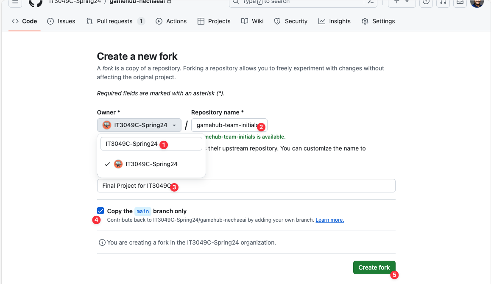
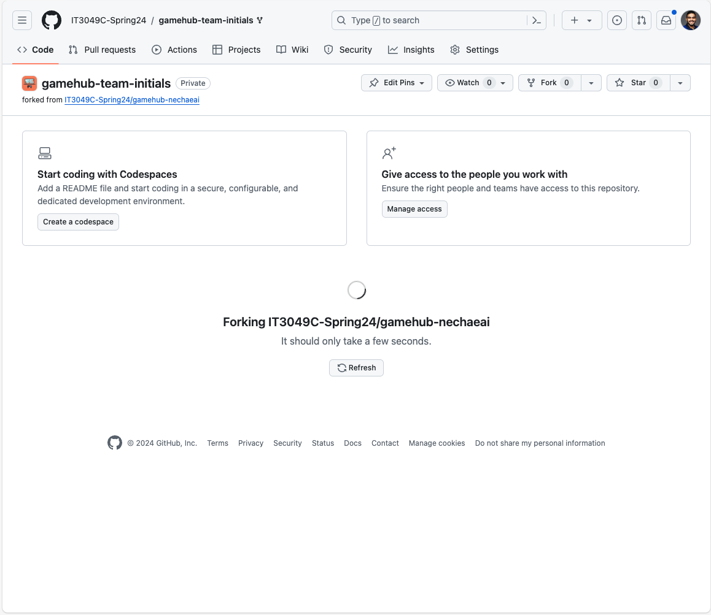
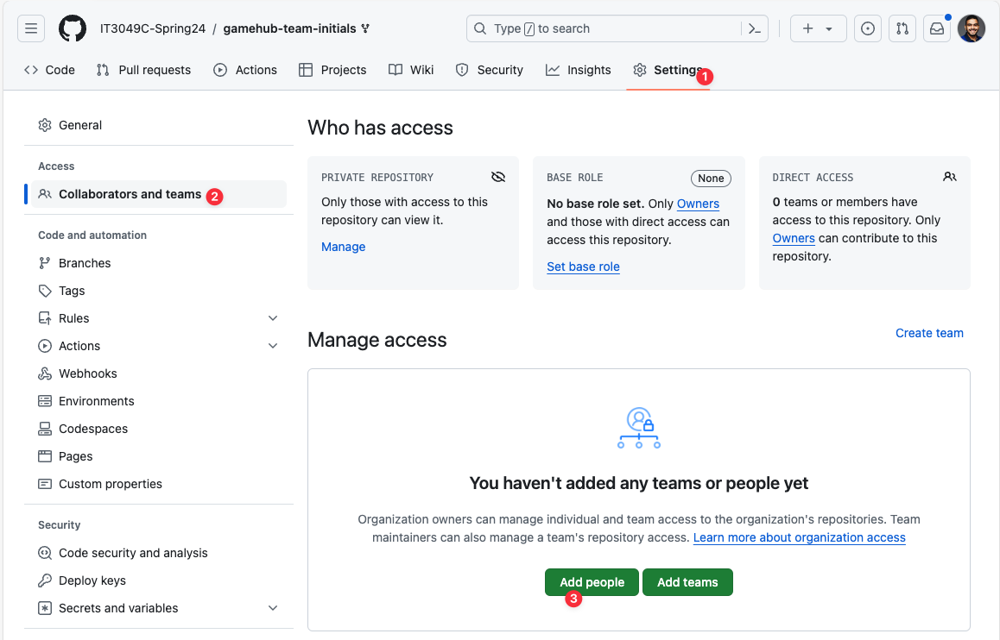
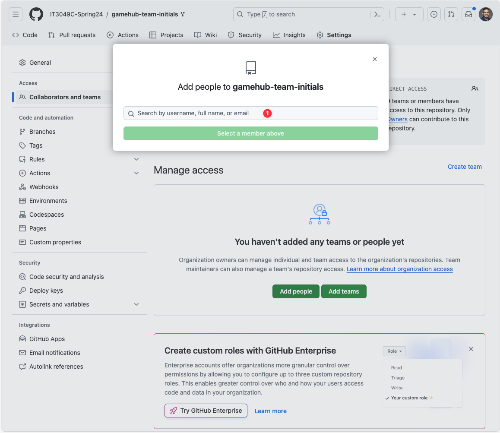

To get a starting point for the final project, you can fork the completed GameHub assignment from one of the team members' previous assignment. This will give you a starting point for the final project.

## Fork the GameHub Assignment
1. **Go to the Repository of chosen GameHub repository.**
2. **On the top right, click the "Fork" button.**
  - 
3. **Create the New Repository/Fork, making sure you update the following options**:
   1. Owner: This has to be the IT3049C-Spring24 organization.
   2. Repository Name: You can choose a custom name for your project, or name it `gamehub-<team initials separated with dashes "-">`.
   3. Update the project description.
   4. You may choose to only fork the main branch, or fork all branches.
   5. Click `Create Fork` to finish the process.
   
4. **Wait for the fork to complete.**
   - 
5. **Update the settings to add the team members as collaborators.**
   1. Go to the `Settings` tab.
   2. Click on the `Collaborators and Teams` tab.
   3. Click on the `Add People` button.
   4. Add the team members as collaborators.
   
   

## Reconfigure the GameHub Assignment
Make sure you:
- Update the project name on the `package.json` file.
- Update the `README.md` file with:
  - The project name.
  - The project description.
  - The team members' names.
- Update the project name on the `README.md` file.
- Update the project name on the title of `public/index.html` file.
- Update the base on the `vite.config.json` file.
